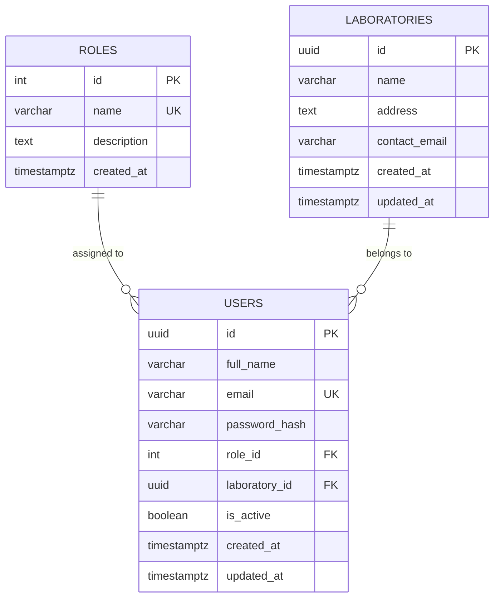

# System Architecture & Technical Specifications

**Project**: NAWI Test Report Generation System  
**SIH 2026 Problem Statement**: 26035  
**Topic**: "Development of a Software Program/Application for Generation of Test Reports for Non-Automatic Weighing Instruments (NAWI) as per OIML Recommendation R-76"  
**Current Milestone**: Phase 1 — Foundation & Authentication

---

## 1. High-Level Target Architecture

The system operates strictly as a **fully local, secure, self-contained multi-tier enterprise application**. It intentionally eliminates cloud-hosted backends, third-party authentication services, and external BaaS providers (no Supabase, Firebase, or MongoDB Atlas).

```
               [ Laboratory Operator / Metrologist ]
                                |
                                v
               +----------------------------------+
               |      React 19 + TypeScript       |
               |      Vite + Tailwind CSS         |
               |      (Client: Localhost:5173)   |
               +----------------------------------+
                                |
                   HTTP / REST (JSON API)
                   Bearer JWT Authorization
                                v
               +----------------------------------+
               |     Node.js + Express 4 (TS)     |
               |  - Helmet / CORS Security        |
               |  - Rate Limiting                 |
               |  - Zod Request Validation        |
               |  - RBAC Middleware               |
               |      (Server: Localhost:5000)   |
               +----------------------------------+
                                |
                   pg Connection Pool
                   Parameterized SQL
                                v
               +----------------------------------+
               |      Local PostgreSQL 18         |
               |      Database: nawi_r76          |
               |  - Roles, Users, Laboratories    |
               |  - Foreign Keys & UUIDs          |
               |      (Localhost:5432)            |
               +----------------------------------+
```

---

## 2. Authentication & Authorization Lifecycle

### 2.1 Registration Flow
1. **Request Intake**: Public users submit `full_name`, `email`, `password`, and `confirm_password` to `POST /api/auth/register`.
2. **Validation**: Zod schema validates email syntax, password minimum length (8 characters), and matching password confirmation.
3. **Role Boundary**: Public registration strictly assigns the `technician` role (`role_id: 3`). Frontend role override is blocked at the backend service layer.
4. **Password Hashing**: Passwords are encrypted using `bcryptjs` with salt work factor 12. Plaintext passwords and confirmation fields are never persisted or logged.
5. **Entity Persistence**: User record is created with a cryptographically secure UUID (`gen_random_uuid()`) in PostgreSQL.
6. **Token Issuance**: A signed JWT containing `userId`, `email`, and `role` is generated and returned with sanitized user details (excluding `password_hash`).

### 2.2 Login & Session Management Flow
1. **Credential Submission**: User submits `email` and `password` to `POST /api/auth/login`.
2. **Lookup & Verification**:
   - User record retrieved by lowercase email.
   - `bcrypt.compare` verifies password against stored `password_hash`.
   - Inactive accounts (`is_active: false`) are blocked with HTTP `403`.
3. **Session Token**:
   - Signs standard JWT using server-side `JWT_SECRET`.
   - Client stores token in browser `localStorage` under `nawi_token`.
   - Client Axios interceptor automatically attaches `Authorization: Bearer <token>` to all protected API calls.
4. **Session Bootstrap (`GET /api/auth/me`)**:
   - On page refresh, React application issues `GET /api/auth/me` to rehydrate user profile, role, and laboratory assignment without re-authenticating.

### 2.3 Role-Based Access Control (RBAC)
- **Security Boundary**: Implemented in Express middleware (`authenticateToken` followed by `authorizeRoles('admin', ...)`). Frontend role checks are UX conveniences only; the backend strictly enforces authorization.
- **Roles Defined**:
  - `admin`: Full system oversight, laboratory creation, user role management.
  - `officer`: Authorized legal metrology officer; reviews calibration sessions, test compliance, and signs off reports.
  - `technician`: Test data entry operator; executes measurement intake, observation recording, and OCR captures.

---

## 3. Database Schema (Phase 1 Foundation)



- **UUID Primary Keys**: Users and Laboratories utilize `gen_random_uuid()`.
- **Referential Integrity**: `users.role_id` uses `ON DELETE RESTRICT` to prevent orphan roles. `users.laboratory_id` uses `ON DELETE SET NULL`.
- **Triggers**: Automatic `updated_at` modification timestamps managed via PostgreSQL plpgsql function `update_updated_at_column()`.
- **Indexes**: Explicit B-tree indexes on `users(email)`, `users(role_id)`, and `users(laboratory_id)`.

---

## 4. Future Integration Architecture (Phases 2–6)

In compliance with the project roadmap, future tables and calculation pipelines are purposely decoupled until their designated phases:

### Phase 2: Instrument + OCR
- **Module Intake**: Upload nameplate photographs or equipment labels.
- **OCR Engine**: Local OCR extraction (Tesseract.js / lightweight Python worker) to extract `Max`, `Min`, `e`, `d`, serial number, and accuracy class (Class I, II, III, IIII).
- **Schema Additions**: `instruments` table linked to `laboratories`.

### Phase 3: R-76 Testing & Calculation Engine
- **Test Modules**:
  1. Weighing Performance (increasing and decreasing loads).
  2. Maximum Permissible Error (MPE) evaluation based on test load in relation to verification scale intervals ($m/e$).
  3. Repeatability Test (standard deviation and range comparison across 3 or 10 weighings).
  4. Eccentricity Test (corner loading with $1/3 \text{ Max}$ or $1/4 \text{ Max}$ depending on platform geometry).
  5. Tare balancing and tare weighing accuracy.
- **Schema Additions**: `test_sessions`, `test_observations`, `mpe_evaluations`.

### Phase 4: Report Generation + QR Verification
- **PDF Compilation**: Generating official test report certificates formatted per OIML R-76 Annex A / Annex B model formats.
- **Cryptographic QR**: Signing report metadata with digital signature and generating verifiable QR codes linking back to verification endpoint.
- **Schema Additions**: `test_reports`, `digital_signatures`.

### Phase 5: Dashboard & Repository
- **Metrological Archive**: Complete search, filter, and export of past test records.
- **Auditing**: Tamper-proof history tracking for test modifications.

### Phase 6: Polish & SIH Evaluation
- **End-to-End Hardening**: Production bundling, demo scenarios, load testing, and metrology officer review presentation.
